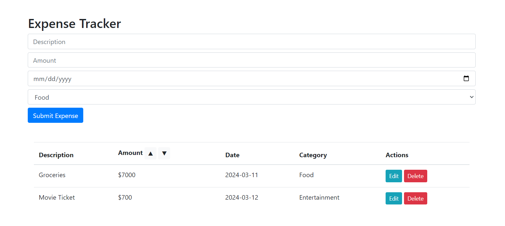

# Expense Tracker

A simple Expense Tracker application that allows users to add, edit, delete, and sort expenses. The app also saves expenses in `localStorage` so they persist across page reloads. This project is built with **HTML**, **Bootstrap**, and **JavaScript**, and it demonstrates basic **CRUD operations** using JavaScript.

## Features

1. **Add New Expense**: Users can add new expenses by entering the description, amount, date, and category (Food, Transport, Entertainment).
2. **Edit Expense**: Users can edit any existing expense by selecting the "Edit" button in the list.
3. **Delete Expense**: Users can delete an expense after confirming their choice.
4. **Sort Expenses by Amount**: Users can sort the expenses by amount in ascending or descending order using the up and down arrows.
5. **Persistent Storage**: Expenses are stored in the browser’s `localStorage` so that data remains after the page is refreshed.

## Technologies Used

- **HTML**: For the structure of the web page.
- **Bootstrap**: For basic styling and responsive layout.
- **JavaScript**: For implementing CRUD operations and manipulating the DOM.
- **LocalStorage**: For storing expenses locally to make them persist after refresh.

## How to Use

1. Clone or download the project repository.

   ```bash
   git clone https://git.brainster.co/Lutmira.Peci-3/brainsterchallenges_lutmirapecife3

   ```

2. Open the `index.html` file in a browser.
3. Enter the expense details (description, amount, date, and category) and click **Submit Expense** to add it to the list.
4. The list of expenses will be displayed in the table below the form.
5. Use the **Edit** button to modify an existing expense, or the **Delete** button to remove it.
6. You can sort the expenses by amount using the up and down arrows beside the **Amount** header.

## Screenshots



## Project Structure

```bash
.
├── index.html        # Main HTML file
├── script.js         # JavaScript file for handling functionality
├── screenshot.png    # Screenshot of the project
└── README.md         # Project documentation
```

## Future Enhancements

- **Filter by Date or Category**: Add the ability to filter expenses by category or date range.
- **Total Calculation**: Display the total amount of expenses below the list.
- **Responsive Design**: Enhance the design for smaller screens for better mobile usability.
- **Expense Categories**: Allow users to create custom categories for expenses.

---
